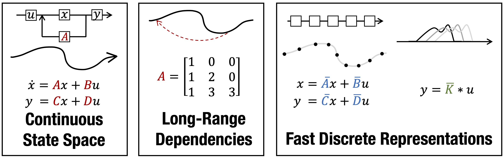

# Structured State Space for Sequence Modelling (S4)

This repository aims to implement S4 model, presented by [Gu et al.](https://arxiv.org/abs/2111.00396) in [ICRL2022](https://iclr.cc/Conferences/2022)
and follow further research on this topic. Code is in [JAX](https://jax.readthedocs.io/en/latest/).

Initial code is inspired from [S4 blog by @srush](https://srush.github.io/annotated-s4/). Unlike this blog
which aims to develope intuition for S4 model and the math behind it, this repo is more of a appreciation
and analysis of the jax implementation over standard python implementation.

## Implemented Papers

## S4 (ICLR 2022 - Outstanding Paper HM)
----------------------------------------------------

> **Efficiently Modeling Long Sequences with Structured State Spaces**\
> Albert Gu, Karan Goel, Christopher Ré\
> Paper: https://arxiv.org/abs/2111.00396

----------------------------------------------------
## Diagonal State Spaces are as Effective as Structured State Spaces
----------------------------------------------------
> **Diagonal State Spaces are as Effective as Structured State Spaces**\
> Ankit Gupta\
> Paper: https://arxiv.org/pdf/2203.14343
----------------------------------------------------

## Motivation

- I wanted to learn [JAX](https://jax.readthedocs.io/en/latest/)
- Wanted to write cool maths
- Analyse the difference between pytroch and jax implementation
- Follow a research topic closely

## Experiments

#### MNIST Sequence Modeling

```bash
python -m s4.train --dataset mnist --model s4 --epochs 100 --bsz 128 --d_model 128 --ssm_n 64
```

#### QuickDraw Sequence Modeling

```bash
# Default arguments
python -m s4.train --dataset quickdraw --model s4 --epochs 10 --bsz 128 --d_model 128 --ssm_n 64

# "Run in a day" variant
python -m s4.train --dataset quickdraw --model s4 --epochs 1 --bsz 512 --d_model 256 --ssm_n 64 --p_dropout 0.05
```

#### MNIST Classification

```bash
python -m s4.train --dataset mnist-classification --model s4 --epochs 10 --bsz 128 --d_model 128 --ssm_n 64
```

<!-- Gets "best" 97.76% accuracy in 10 epochs @ 40s/epoch on a TitanRTX. -->

#### Experiments_TODO
- [ ] Train jax and torch version of [S4]() and [DSS]() and compare effeciency


## Quickstart (Development)

We have two `requirements.txt` files that hold dependencies for the current project: one that is tailored to CPUs,
the other that installs for GPU.

### CPU-Only (MacOS, Linux)

```bash
# Set up virtual/conda environment of your choosing & activate...
pip install -r requirements-cpu.txt

# Set up pre-commit
pre-commit install
```

### GPU (CUDA > 11 & CUDNN > 8.2)

```bash
# Set up virtual/conda environment of your choosing & activate...
pip install -r requirements-gpu.txt

# Set up pre-commit
pre-commit install
```

## Dependencies from Scratch

In case the above `requirements.txt` don't work, here are the commands used to download dependencies.

### CPU-Only

```bash
# Set up virtual/conda environment of your choosing & activate... then install the following:
pip install --upgrade "jax[cpu]"
pip install flax
pip install torch torchvision torchaudio

# Defaults
pip install black celluloid flake8 google-cloud-storage isort ipython matplotlib pre-commit seaborn tensorflow tqdm

# Set up pre-commit
pre-commit install
```

### GPU (CUDA > 11, CUDNN > 8.2)

Note - CUDNN > 8.2 is critical for compilation without warnings, and GPU w/ at least Turing architecture for full
efficiency.

```bash
# Set up virtual/conda environment of your choosing & activate... then install the following:
pip install jax[cuda11_cudnn82] -f https://storage.googleapis.com/jax-releases/jax_releases.html
pip install flax
pip install torch==1.10.1+cpu torchvision==0.11.2+cpu torchaudio==0.10.1+cpu -f https://download.pytorch.org/whl/cpu/torch_stable.html

# Defaults
pip install black celluloid flake8 google-cloud-storage isort ipython matplotlib pre-commit seaborn tensorflow tqdm

# Set up pre-commit
pre-commit install
```

## TODO

- [ ] Write jax commentry in a notebook
- [ ] Present in a tab format to compare between pytorch and jax implementation
- [ ] Write unit tests

## Citation


```
@article{gupta2022dss,
  title={Diagonal State Spaces are as Effective as Structured State Spaces},
  author={Gupta, Ankit},
  journal={arXiv preprint arXiv:2203.14343},
  year={2022}
}

@inproceedings{gu2022efficiently,
  title={Efficiently Modeling Long Sequences with Structured State Spaces},
  author={Gu, Albert and Goel, Karan and R\'e, Christopher},
  booktitle={The International Conference on Learning Representations ({ICLR})},
  year={2022}
}

```
